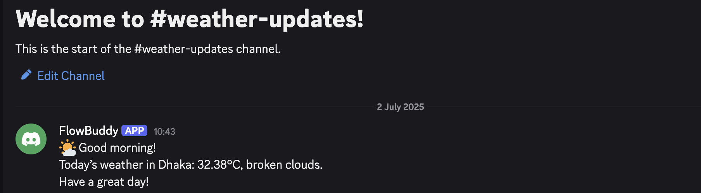

# 🌦️ Discord Weather Updates Bot (n8n)

This project is a no-code automation workflow built using [n8n](https://n8n.io/) that sends **daily weather updates** to a specific Discord channel via a custom bot.

---

## 🚀 What It Does

- 🕒 Runs automatically every morning at your chosen time (via Cron)
- ☁️ Fetches real-time weather data from [OpenWeatherMap](https://openweathermap.org/)
- 💬 Sends a clean, friendly message to your Discord channel like:

> 🌤 Good morning!  
> Today’s weather in Dhaka: **31.6°C**, **clear sky**.  
> Have a great day!

---

## 🔧 How It Works

| Node        | Purpose                              |
|-------------|--------------------------------------|
| **Cron**    | Triggers the workflow every day      |
| **HTTP**    | Calls OpenWeatherMap API             |
| **Set**     | Formats the weather message          |
| **Discord** | Sends the message to your server     |

---

## 🌐 Requirements

- A verified [OpenWeatherMap API key](https://openweathermap.org/api)
- A Discord bot created via the [Discord Developer Portal](https://discord.com/developers/applications)
- n8n cloud or self-hosted instance
- Your Discord channel ID

---

## 🛠️ Setup Instructions

1. Clone this repo or copy the `Discord_Weather_Updates.json` workflow
2. Import it into your n8n dashboard
3. Replace:
   - `YOUR_API_KEY` with your OpenWeatherMap API key
   - `Your Discord Channel ID` with your actual Discord channel ID
4. Activate the workflow
5. Done ✅

---

## 📸 Screenshot

Here’s how the bot looks when it posts to Discord:

